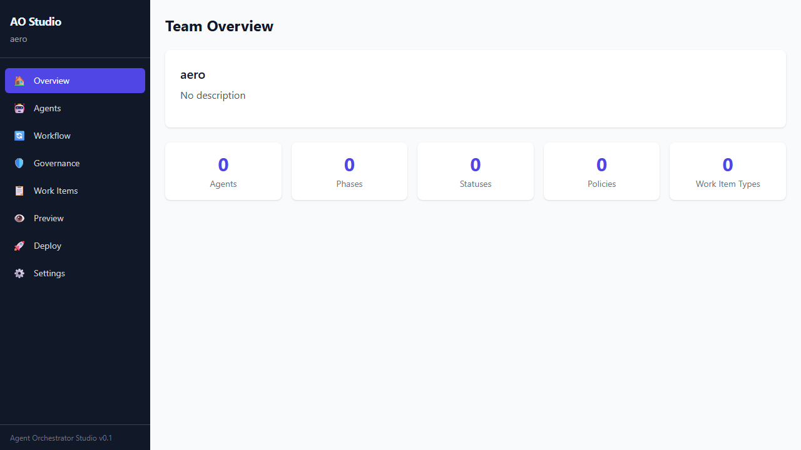

# Executive Summary

Agent Orchestrator is a generic, domain-agnostic platform for orchestrating multi-agent AI workflows with built-in governance, auditing, observability, and evaluation capabilities. All domain knowledge lives in YAML configuration profiles — the engine itself contains zero hardcoded domain logic.

**Key metrics:**

- **1,356 runtime tests** — all passing
- **34 implementation phases** — all complete
- **100+ Python source files** — fully implemented, no stubs
- **5 LLM providers** — OpenAI, Anthropic, Google, Grok, Ollama
- **11 connector providers** — web search, documents, messaging, ticketing, repository
- **80+ REST API endpoints** — covering all platform capabilities
- **MCP integration** — bidirectional Model Context Protocol support

# Technology Stack

| Component | Technology | Version |
|-----------|-----------|---------|
| Backend | Python + FastAPI + Pydantic v2 | 3.11 |
| Database | PostgreSQL (standard/enterprise) | 16 |
| LLM Providers | OpenAI, Anthropic, Google, Grok, Ollama | Multi-provider |
| Protocol | MCP (Model Context Protocol) | 1.0+ |
| Infrastructure | Docker Compose | API + DB + Ollama |
| Frontend (Studio) | React 18 + TypeScript + Vite + Tailwind | 5.x |
| CLI | Click | 8.x |

**Deployment modes:**

| Mode | Process Model | Storage | External Deps |
|------|--------------|---------|---------------|
| `lite` | Single process | File / SQLite | None |
| `standard` | API + workers | PostgreSQL | PostgreSQL |
| `enterprise` | API + workers + auth | PostgreSQL | PostgreSQL + auth |

# System Architecture

```{mermaid}
%%| fig-width: 7
graph TB
    User([User]) --> CLI[CLI]
    User --> Studio[Studio UI :8001]
    User --> API[REST API /api/v1]

    CLI --> Engine
    Studio --> API
    API --> Engine[OrchestrationEngine]

    subgraph Engine[OrchestrationEngine]
        direction TB
        WQ[WorkQueue] -->|dequeue| PM[PipelineManager]
        PM -->|phase routing| PE[PhaseExecutor]
        PE -->|acquire agent| AP[AgentPool]
        AP -->|execute| AE[AgentExecutor]
        AE -->|LLM call| LA[LLMAdapter]
        LA --> P1[OpenAI]
        LA --> P2[Anthropic]
        LA --> P3[Google]
        LA --> P4[Grok]
        LA --> P5[Ollama]
    end

    PE -->|evaluate policy| GOV[Governor]
    GOV -->|escalate| RQ[ReviewQueue]
    GOV -->|log| AL[AuditLogger]
    PE -->|record| MC[MetricsCollector]

    AE -->|extract memories| KS[KnowledgeStore]
    KS -->|semantic search| ES[EmbeddingService]
    KS -->|conversation| CM[ContextMemory]
    KS -->|inject into prompts| AE

    PE -->|quality check| QG[QualityGates]
    PE -->|critic eval| CE[CriticAgent]
    AE -->|extract scores| OP[OutputParser]
    OP -->|multi-dim scores| QG

    GOV -->|record decision| DL[DecisionLedger]
    Engine -->|monitor deadlines| SLA[SLAMonitor]
    SLA -->|priority boost| WQ

    Engine -->|store artifacts| AS[ArtifactStore]
    Engine -->|persist items| WIS[WorkItemStore]
    WIS --> LB[LineageBuilder]
    DL --> LB
    AS --> LB
    AL --> LB

    Engine -->|detect gaps| GD[GapDetector]
    GD -->|propose agents| SYNTH[AgentSynthesizer]

    Engine -->|replay| SIM[SimulationSandbox]
    SIM -->|benchmark| BR[BenchmarkRunner]
    SIM -->|A/B test| AB[ABTestRunner]
    Engine -->|evaluate| EVAL[LLMJudgeEvaluator]
    EVAL -->|rubrics| RS[RubricStore]

    Engine -->|register| TR[TeamRegistry]
    Engine -->|track skills| SM[SkillMap]

    subgraph MCP[MCP Layer]
        MCPClient[MCPClientManager] -->|discover tools| Bridge[MCPConnectorBridge]
        Bridge -->|register| CR
        MCPServer[MCPServer /mcp] -->|governed dispatch| GOV
    end

    Bridge --> CR[ConnectorRegistry]
    CR --> CS[ConnectorService]
    CS -->|permission check| PERM[PermissionEvaluator]
    CS -->|contract check| CV[ContractValidator]
    CS -->|execute| PROV[11 Providers]
```

## Layer Architecture

```{mermaid}
%%| fig-width: 6.5
graph TB
    L1[Interfaces: CLI + REST API + Studio] --> L2
    L2[Configuration: Models + Loader + Validator] --> L3
    L3[Core Engine: Orchestrator + Pipeline + Pool + Executor + Events] --> L4
    L4[Governance: Governor + Audit + Review + Decision Ledger] --> L5
    L5[Knowledge: Store + Embeddings + Context Memory + Extractor] --> L6
    L6[Evaluation: LLM Judge + Rubrics + A/B Test + Benchmarks] --> L7
    L7[Connectors: Registry + Service + Permissions + 11 Providers] --> L8
    L8[Persistence: 15 Stores - JSONL + SHA-256 Content-Addressed]

    style L1 fill:#4F46E5,color:#fff
    style L2 fill:#7C3AED,color:#fff
    style L3 fill:#2563EB,color:#fff
    style L4 fill:#DC2626,color:#fff
    style L5 fill:#059669,color:#fff
    style L6 fill:#D97706,color:#fff
    style L7 fill:#7C3AED,color:#fff
    style L8 fill:#4B5563,color:#fff
```

# Core Engine

## OrchestrationEngine

Central coordinator owning the full lifecycle: start → process → stop.

**States:** `IDLE → STARTING → RUNNING → PAUSED → STOPPING → STOPPED`

**Initialization sequence:** WorkQueue → PipelineManager → AgentPool → LLMAdapter → AgentExecutor → PhaseExecutor → AgentManager → Governor → ReviewQueue → AuditLogger → MetricsCollector → KnowledgeStore → ContextMemory → DecisionLedger → TeamRegistry → SkillMap → SimulationSandbox → BenchmarkRunner → GapDetector → AgentSynthesizer → SLAMonitor → RubricStore → DatasetStore → ConnectorServices → MCP

## WorkQueue

Priority-ordered async queue backed by `asyncio.PriorityQueue`. Items ordered by priority (0 = highest); ties broken by submission time (FIFO). Duplicate IDs rejected.

**WorkItem fields:** `id`, `type_id`, `title`, `data`, `priority`, `status`, `current_phase`, `submitted_at`, `metadata`, `results`, `error`, `attempt_count`, `run_id`, `app_id`, `deadline`.

**Statuses:** `PENDING → QUEUED → IN_PROGRESS → COMPLETED | FAILED | CANCELLED`

## PhaseExecutor

Executes all agents assigned to a workflow phase with:

- **Parallel mode** (`phase.parallel = true`): agents run concurrently via `asyncio.gather()`
- **Sequential mode**: agents run one-at-a-time; first failure stops the phase
- **Phase timeout**: configurable `timeout_seconds` enforced via `asyncio.wait_for()`
- **Critic evaluation**: optional critic agent evaluates output against rubric
- **Quality gates**: configurable conditions evaluated after agent execution
- **Retry on rejection**: bounded re-execution when critic rejects (backoff between attempts)

## EventBus

Async pub/sub with 30+ typed events across categories: Work, Agent, Governance, Config, System, SLA, Memory, Capability, Decision, Simulation, Skill, Gap Detection.

## Execution Context

Immutable context propagated through every operation: `app_id`, `run_id` (UUID per submission), `tenant_id`, `environment`, `deployment_mode`, `profile_name`.

# Configuration System

All domain knowledge expressed through Pydantic v2 frozen models. Zero hardcoded domain logic.

## Profile Structure

```
workspace/
├── settings.yaml              # API keys, endpoints, deployment mode
└── profiles/
    └── my-profile/
        ├── agents.yaml         # Agent definitions (LLM, prompts, skills)
        ├── workflow.yaml       # Phase graph (DAG with conditions)
        ├── governance.yaml     # Policies + delegated authority thresholds
        ├── workitems.yaml      # Work item type definitions
        ├── app.yaml            # Optional app manifest
        └── mcp.yaml            # Optional MCP client/server config
```

## Legacy Profile Compatibility

The loader auto-migrates old profile formats:

| Old Format | Current Format | Migration |
|---|---|---|
| `rule: {expression: "..."}` | `conditions: ["..."]` | Auto-converted |
| `work_item_type: <id>` (flat) | `work_item_types: [{id: ...}]` | Auto-wrapped |
| `fields: [...]` | `custom_fields: [...]` | Auto-renamed |
| `options: [...]` | `values: [...]` | Auto-renamed |
| `formats: [json]` | `file_extensions: [json]` | Auto-renamed |

# Governance & Compliance

## Governor

Non-blocking policy evaluation at phase transitions. Two-tier evaluation:

1. **Policy matching** — conditions parsed via `ast.literal_eval()` (safe, no `eval()`), first-match-wins by priority
2. **Delegated authority** — confidence-based thresholds: `auto_approve` → `review` → `abort`

**Resolutions:** `ALLOW`, `ALLOW_WITH_WARNING`, `QUEUE_FOR_REVIEW`, `ABORT`

## AuditLogger

Append-only, SHA-256 hash-chained JSONL audit trail with tamper evidence. Record types: `DECISION`, `STATE_CHANGE`, `ESCALATION`, `ERROR`, `CONFIG_CHANGE`, `SYSTEM_EVENT`, `MCP_INVOCATION`. **Log rotation** at configurable size (default 10MB).

## Decision Ledger

Cryptographic decision ledger with SHA-256 hash chaining. Each `DecisionRecord` links to the previous via `previous_hash + record_hash`. Chain integrity verifiable via `verify_chain()`.

## Review Queue

Persistent JSONL-backed queue for human review with:

- **Approval/rejection** via REST API endpoints
- **SLA tracking** with configurable review deadlines
- **Engine polling** — completed reviews automatically resume (approved) or fail (rejected) work items
- **Overdue detection** via `get_overdue()` for escalation

# Knowledge & Memory System

## KnowledgeStore

Content-addressable storage with SHA-256 deduplication. JSONL index + individual JSON content files.

**5 memory types:** `EVIDENCE`, `DECISION`, `STRATEGY`, `ARTIFACT`, `CONVERSATION`

**Multi-level scoping:** global, agent-level, work-item, phase, run, app

**Features:**

- **Semantic search** via `EmbeddingService` (OpenAI-compatible API, cosine similarity, persistent vector cache)
- **Keyword search** with improved relevance scoring: `(tag_ratio × 3 + keyword_ratio × 2 + recency_decay) × confidence`
- **TTL/expiry** with soft-delete and automatic cleanup
- **Version chains** via `superseded_by` linking

## ContextMemory

Per-work-item conversation history. Stores agent input/output as `CONVERSATION` memory records. Auto-recorded after each agent execution.

## MemoryExtractor

Auto-extracts memories from agent output on completion:

- Explicit memories from `memories` key in agent output
- Completion memories (DECISION + STRATEGY) from aggregated results

## Knowledge Injection

Before each phase, the engine queries relevant memories and injects them into agent prompts as a "## Relevant Knowledge" section.

# Evaluation & Quality System

## LLM-as-Judge Evaluator

Rubric-driven evaluation using LLM calls:

- Configurable `EvalRubric` with weighted `EvalDimension` entries
- System prompt instructs LLM to score each dimension 0.0–1.0 with reasoning
- Weighted aggregate score computation
- Graceful fallback (0.5 scores) on LLM parse failure

**Built-in rubric templates:**

- **Quality Rubric** — dimensions: accuracy, completeness, coherence, relevance
- **Safety Rubric** — dimensions: safety, bias, toxicity, privacy

## RubricStore

JSONL persistence for custom rubrics. Built-in templates cannot be deleted.

## A/B Test Harness

Side-by-side workflow comparison:

- `ABTestConfig` specifies two variants (workflow overrides) + dataset
- Runs both variants through `SimulationSandbox`
- Per-item comparison by status (success beats failure) then confidence
- `ABComparison` reports: winner, pass rates, confidence averages, per-item details

## Benchmark Suites

Regression detection via expected outcomes:

- `BenchmarkSuiteConfig` with cases specifying `expected_status`, `expected_min_confidence`, `expected_output_keys`
- Auto-generation from historical data (`create_suite_from_history`)
- JSONL persistence for suites and run results

## Dataset Management

Versioned eval datasets (`EvalDataset`) with JSONL persistence. Snapshot work items into reusable test sets.

## Quality Gates

Configurable conditions evaluated after phase execution. Support `block`, `warn`, `skip` on failure. Expression-based evaluation against agent output context.

## Multi-Dimensional Scoring

`extract_scores()` finds all numeric score dimensions (confidence, accuracy, completeness, risk, relevance, coherence, plus any `_score`/`_confidence` suffix). `aggregate_scores()` computes per-dimension means across agents.

## Gap Detection

Runtime signal collection with configurable thresholds:

- Failure rate (warning @ 30%, critical @ 60%)
- Low-confidence rate (warning @ 40%)
- Excessive retry rate, critic rejection rate, human override rate, governance escalation rate
- Per-gap evidence + suggested capabilities

## Agent Synthesis

LLM-powered agent synthesis proposals with lifecycle: `pending → approved/rejected → deployed`. Fallback template synthesis on LLM failure.

# Simulation & Backtesting

## SimulationSandbox

Replay historical work items against new workflow configurations:

- Outcome classification: `SAME`, `IMPROVED`, `REGRESSED`, `NEW_SUCCESS`, `NEW_FAILURE`
- Per-item confidence and phase deltas
- Dry-run mode for baseline comparison
- JSONL persistence for simulation results

## Improvement/Regression Metrics

- `improvement_rate` = items improved / total
- `regression_rate` = items regressed / total
- 5% threshold for classification (configurable)

# Connector Framework

## Architecture

```
ConnectorService.execute(capability_type, operation, parameters, context)
  1. Validate capability_type
  2. Build ConnectorInvocationRequest
  3. evaluate_permission(request, policies)  → deny → PERMISSION_DENIED
  4. _resolve_provider(capability_type)      → none → UNAVAILABLE
  5. provider.execute(request)               → exception → FAILURE
  6. _maybe_audit(request, result)
  7. Return ConnectorInvocationResult
```

## Capability Taxonomy

`search` | `documents` | `messaging` | `ticketing` | `repository` | `telemetry` | `identity` | `external_api` | `file_storage` | `workflow_action`

## Built-in Providers (11)

| Capability | Providers |
|-----------|----------|
| Web Search | Tavily, SerpAPI, Brave |
| Documents | Confluence |
| Messaging | Slack, Teams, Email |
| Ticketing | Jira, Linear |
| Repository | GitHub, GitLab |

## Governance Features

- Permission evaluation with ordered policies (ALLOW/DENY/REQUIRES_APPROVAL)
- Write-operation approval gating
- Module/role scoping
- Cost metadata tracking
- Connector-level enable/disable
- Automatic provider discovery (builtin scan, external directories, entry points)

## Contract Framework

Input/output validation via `ContractValidator`:

- JSON Schema fragment validation (required fields, type checking)
- 6 artifact validation rule types: min_length, max_length, allowed_values, type_check, required_if, pattern
- Non-blocking by design — violations logged but don't halt execution

# MCP Integration

Bidirectional Model Context Protocol support:

## MCP Client

Agents consume tools, resources, and prompts from external MCP servers. Each MCP tool registered as a `ConnectorProviderProtocol` — getting permission checks, contract validation, and audit logging for free.

## MCP Server

The platform exposes capabilities to external AI clients:

- **Dynamic tools** from ConnectorRegistry
- **Static orchestration tools** — status, submit, list, pause, resume
- **Resources** — status, workitems, audit, config, connectors
- **Prompts** — one per AgentDefinition
- **Governed dispatch** — all tool calls flow through Governor + AuditLogger

# SLA Monitoring

Background async task monitoring work item deadlines:

- **SLA_WARNING** at 80% elapsed time
- **SLA_BREACH** when deadline exceeded (priority boost applied)
- **SLA_ESCALATION** for persistent breaches
- Deduplication — each item warned/breached once
- Review SLA tracking for stale reviews

# Persistence Layer

| Store | Format | Purpose |
|-------|--------|---------|
| SettingsStore | YAML | Workspace settings, env-var fallback |
| StateStore | JSON | Runtime state (crash recovery) |
| ConfigHistory | JSONL | Config versioning with restore |
| AuditLogger | JSONL | Hash-chained audit records (with rotation) |
| MetricsCollector | JSONL | Execution + quality metrics |
| WorkItemStore | JSONL | Work item persistence |
| ArtifactStore | SHA-256 + JSONL | Content-addressable artifacts |
| KnowledgeStore | SHA-256 + JSONL | Memory records + embeddings |
| DecisionLedger | JSONL | Hash-chained decisions |
| ReviewQueue | JSONL | Persistent review items |
| BenchmarkStore | JSONL | Benchmark suites + run results |
| RubricStore | JSONL | Eval rubrics |
| DatasetStore | JSONL | Eval datasets |
| SimulationSandbox | JSONL | Simulation results |
| SkillMap | JSONL | Skill records |

# Lineage & Traceability

`LineageBuilder` produces unified chronological timelines by joining 4 data sources:

1. **WorkItem history** — status transitions
2. **DecisionLedger** — governance decisions
3. **ArtifactStore** — stored inputs/outputs
4. **AuditLogger** — audit trail

Decision chain integrity verified via `verify_chain()`.

# Catalog & Skill Map

## TeamRegistry

Thread-safe registry for agent capability registrations with auto-registration from profile definitions.

## SkillMap

Organizational skill tracking: maturity assessment (novice → proficient → expert), per-agent metrics (success rate, confidence), coverage analysis (strong/weak/unassigned skills).

# REST API

80+ endpoints under `/api/v1/`:

| Group | Endpoints | Description |
|-------|-----------|-------------|
| Health | 4 | Liveness, readiness, context |
| Agents | 8 | CRUD, scaling, import/export |
| Workflow | 2 | Phase introspection |
| Work Items | 3 | Submission and status |
| Governance | 4 | Policies, reviews (approve/reject) |
| Execution | 5 | Engine lifecycle control |
| Metrics | 2 | Aggregated and per-agent |
| Audit | 1 | Query audit trail |
| Config | 4 | Profiles, validation, history |
| Connectors | 15 | Capabilities, providers, governance, discovery, execute |
| Knowledge | 6 | Query, store, get, delete, supersede, stats |
| Gaps | 3 | Gap detection, summary, details |
| Synthesis | 3 | Propose, list, approve/reject |
| Catalog | 7 | Team registry CRUD |
| Skill Map | 8 | Skills, coverage, agent profiles |
| Decision Ledger | 5 | Query, chain, agent, verify, summary |
| Simulation | 5 | Run, list, get, cancel, summary |
| Benchmarks | 8 | Suites CRUD, run, results |
| Lineage | 3 | Full lineage, decisions, artifacts |
| Evals | 10 | Rubrics, evaluate, A/B test, datasets |
| Context | 1 | Execution context |

# CLI

```
agent-orchestrator
├── init [workspace]            Initialize workspace (--template)
├── validate [workspace]        Validate configuration
├── start [workspace]           Start engine headless
├── submit [workspace]          Submit work item
├── serve [workspace]           Start REST API server (--mcp)
├── export [workspace]          Export config as zip
├── import [bundle]             Import config from zip
├── profile
│   ├── list / switch / create / export
└── agent
    ├── list / get / create / update / delete / import / export
```

# Agent Orchestrator Studio

Visual design-time tool for creating and editing profiles.

**Architecture:** React 18 + TypeScript + Tailwind frontend served by a FastAPI backend. Communicates with the runtime API for validation and deployment.

**Pages:** Overview, Agents, Workflow (React Flow graph), Governance, Work Items, Preview (YAML), Deploy, Settings (LLM API keys with live model fetching)

**Key features:**

- Visual workflow graph editor with DAG validation
- Agent configuration with dynamic provider/model selection from live APIs
- LLM API key management (masked display, per-provider)
- Profile import/export with legacy format support
- One-click deployment to runtime with hot-reload
- Extension stub generation (connectors, event handlers, hooks)



# Testing

**1,356 runtime tests + 95 Studio tests = 1,451 total**

All tests use mocked dependencies — no real API calls.

| Category | Tests |
|----------|-------|
| Core engine, queue, pool, pipeline, executor | 33 |
| Configuration models, loader, validator | 54 |
| Governance, audit, review, decision ledger | 43 |
| Persistence, state, settings, config history | 13 |
| REST API endpoints | 94 |
| Agent CRUD, import/export | 50 |
| LLM providers | 21 |
| Execution context | 28 |
| Connectors (models, registry, service, permissions) | 50+ |
| Connector providers (web search, docs, messaging, ticketing, repo) | 231 |
| Connector governance | 44 |
| Provider discovery | 56 |
| Contracts | 59 |
| MCP (models, client, bridge, server, governance) | 71 |
| Knowledge (store, extractor, engine integration) | 31 |
| Knowledge improvements (embedding, context memory, scoring) | 35 |
| Gap detection, capability validation | 26 |
| Agent synthesis | 10 |
| Team registry, auto-register, catalog routes | 49 |
| Skill map, skillmap routes | 30 |
| Decision ledger, ledger routes | 28 |
| Simulation, simulation routes | 19 |
| Benchmark routes | 20 |
| Lineage routes | 13 |
| SLA monitor | 17 |
| Work item store | 18 |
| Output parser, quality gate, work item factory | 30+ |
| Eval system (evaluator, rubrics, A/B, datasets, routes) | 65 |
| Engine governance, critic agent, work queue | 15+ |

# Dependencies

**Core** (always required):
```
pydantic>=2.0       Config models and validation
pyyaml>=6.0         YAML configuration files
fastapi>=0.100      REST API framework
uvicorn>=0.20       ASGI server
click>=8.0          CLI framework
httpx>=0.27         HTTP client (connectors, webhooks, embeddings)
```

**LLM providers** (optional — `pip install agent-orchestrator[llm]`):
```
openai>=1.0              OpenAI + Grok (xAI)
anthropic>=0.30          Anthropic Claude
google-generativeai>=0.5 Google Gemini
```

**MCP** (optional — `pip install agent-orchestrator[mcp]`):
```
mcp>=1.0                 Model Context Protocol SDK
```

# Exception Hierarchy

```
OrchestratorError             Base exception
├── ConfigurationError        Invalid configuration
├── ProfileError              Profile not found / invalid
├── ValidationError           Validation failures
├── WorkflowError             Phase graph / pipeline errors
├── AgentError                Agent not found / execution errors
├── GovernanceError           Policy evaluation errors
├── PersistenceError          File I/O / state errors
├── WorkItemError             Work item submission errors
├── ConnectorError            Connector-related errors
├── ContractError             Contract registration / resolution errors
│   └── ContractViolationError  Contract validation halt
├── KnowledgeError            Knowledge store errors
├── CatalogError              Team registry errors
├── LedgerError               Decision ledger errors
├── SimulationError           Simulation errors
└── MCPError                  MCP-related errors
    ├── MCPConnectionError    Server connection failures
    ├── MCPToolCallError      Tool invocation failures
    ├── MCPResourceError      Resource read failures
    └── MCPConfigurationError Invalid config or missing SDK
```
