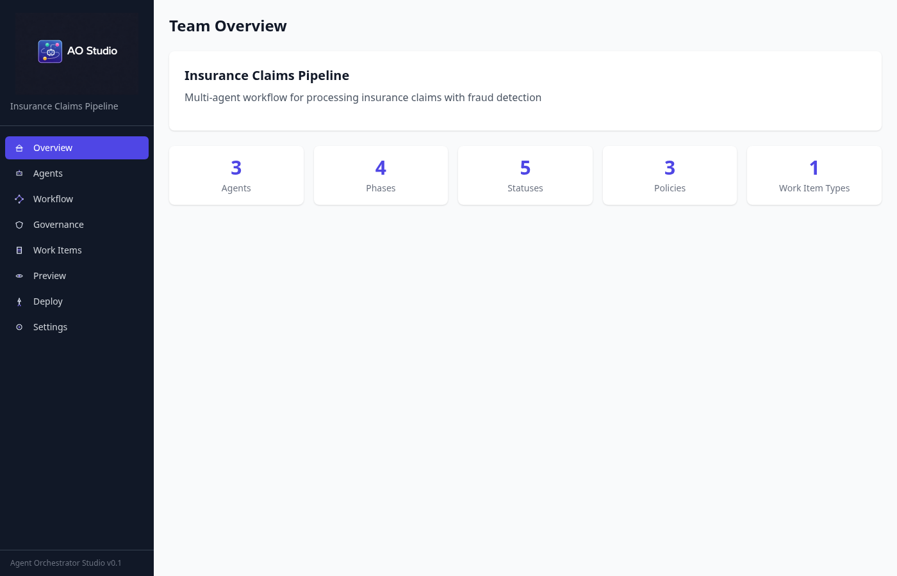
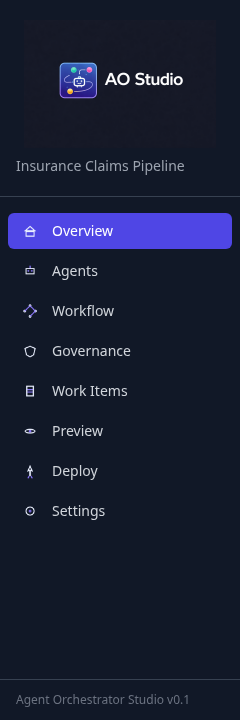
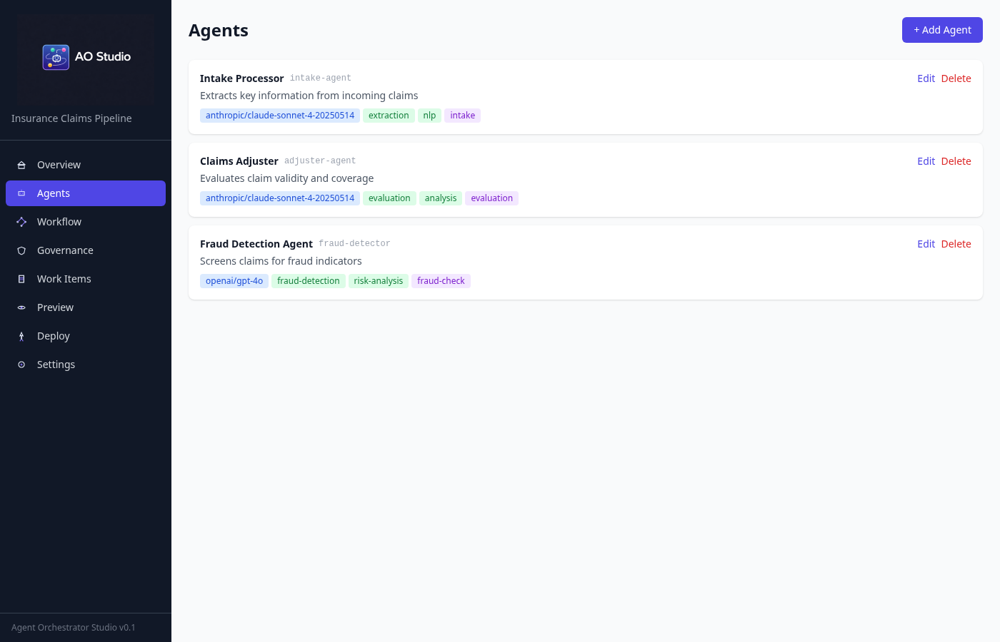
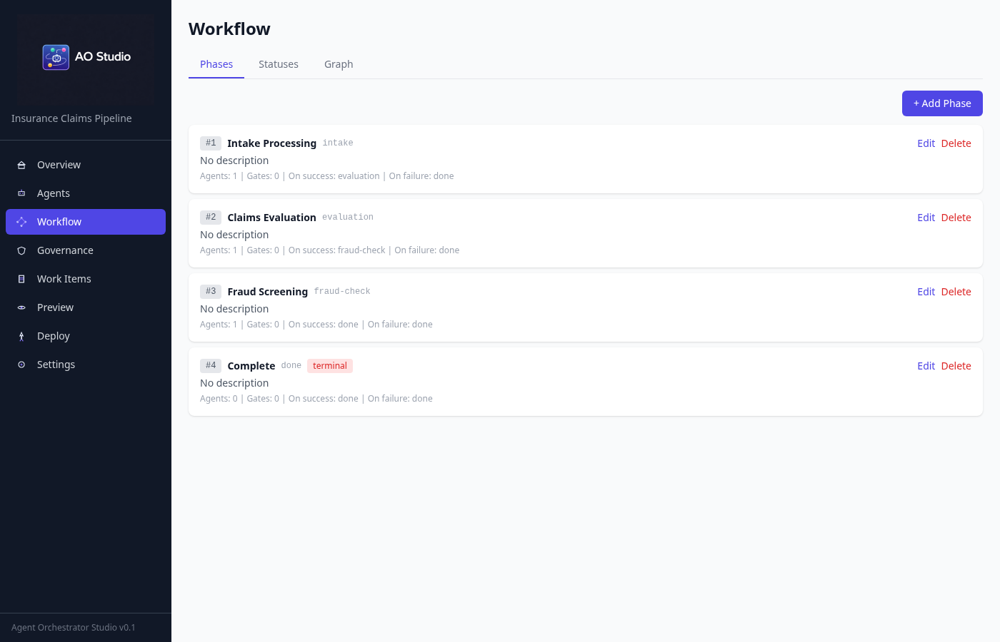
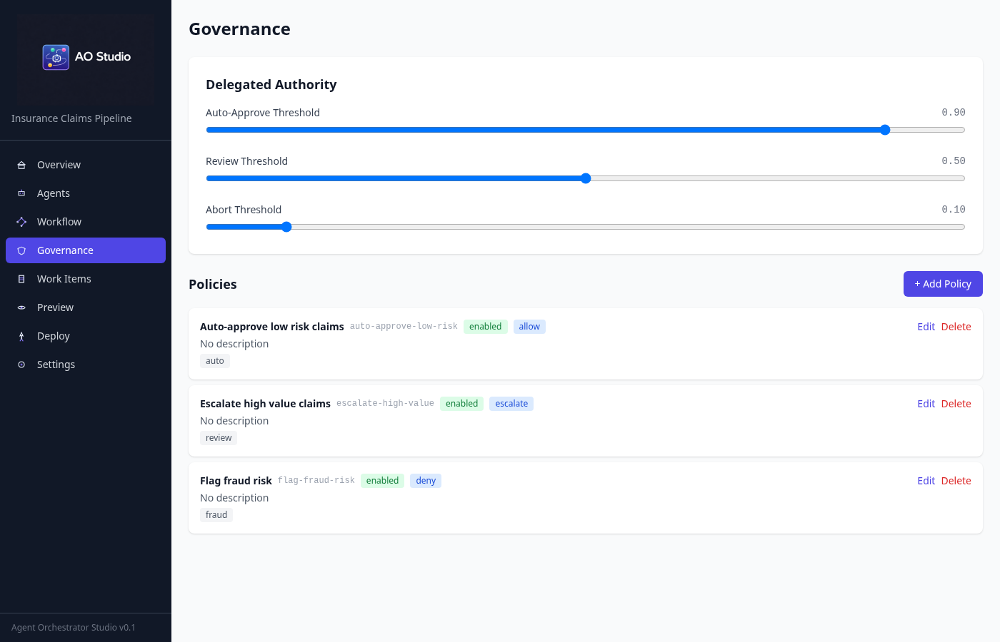
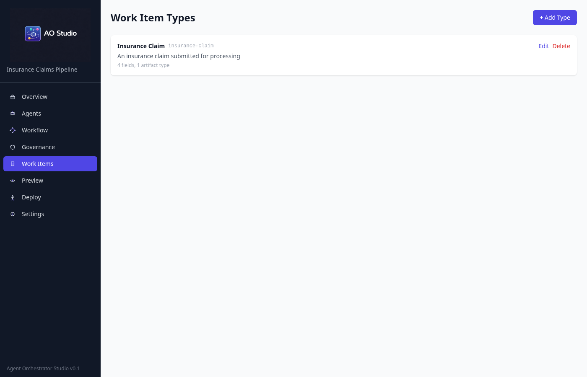
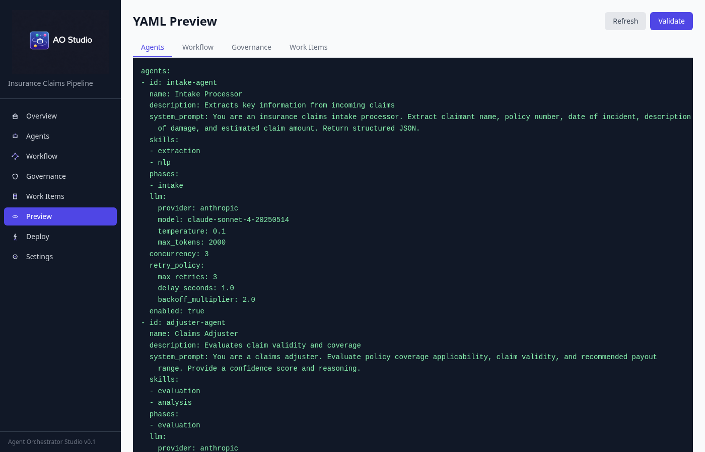
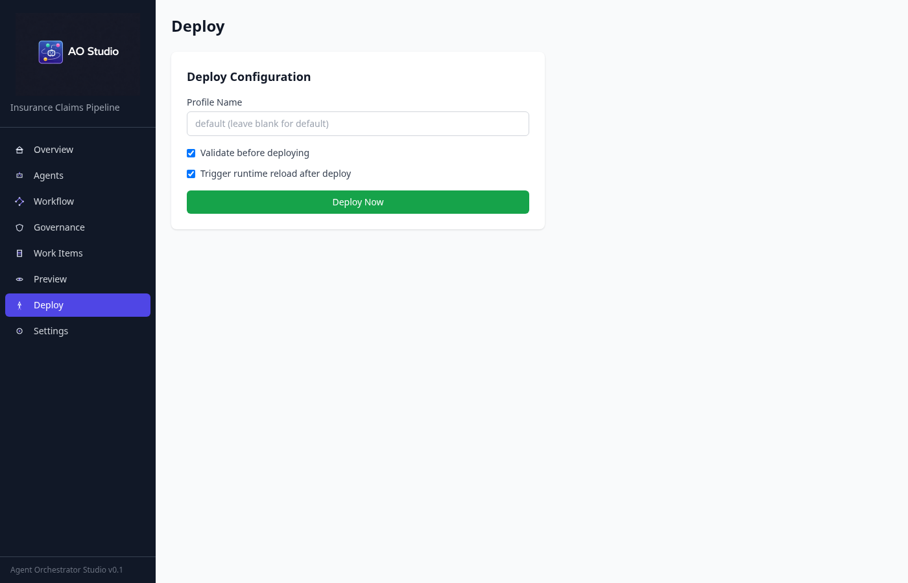
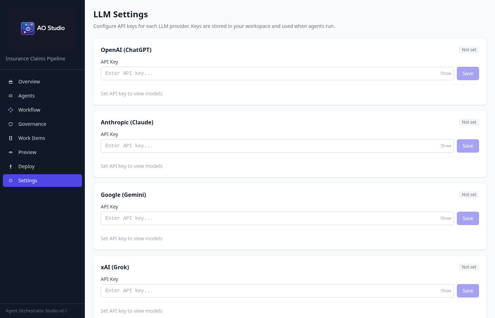

# Introduction

## What is AO Studio?

**AO Studio** (Agent Orchestrator Studio) is a **visual design tool** for building multi-agent AI workflows. Instead of writing YAML configuration files by hand, you use a graphical interface to define agents, wire up workflow phases, set governance policies, and deploy everything to the Agent Orchestrator runtime with a single click.

Think of it as a visual IDE for AI pipelines --- you design how your agents work together, and Studio generates all the configuration needed to run them.

## What is Agent Orchestrator?

**Agent Orchestrator** is the runtime engine that actually executes your workflows. It manages:

- Routing work items through pipeline phases
- Calling LLM providers (OpenAI, Anthropic, Google, Grok, Ollama) for each agent
- Enforcing governance policies (auto-approve, escalate, deny)
- Logging audit trails of every decision
- Persisting state in PostgreSQL

**Studio is the design tool. Agent Orchestrator is the execution engine.** Studio generates YAML files that Agent Orchestrator reads to know what to do.

## Who Is This For?

- **AI engineers** building multi-agent systems without writing boilerplate YAML
- **Team leads** designing agent workflows for specific business domains
- **Operations teams** configuring governance policies and thresholds
- **Developers** who prefer visual tools over text-based configuration

## Key Concepts

### Teams

A **team** is a complete profile that defines everything needed for a workflow. It contains agents, a workflow definition, governance rules, and work item types. You work on one team at a time in Studio.

### Agents

An **agent** is an AI worker with a specific role. Each agent has:

- A **system prompt** that tells the LLM what to do (e.g., "You are a fraud detection specialist...")
- An **LLM configuration** (which provider, model, temperature)
- **Phase assignments** (which workflow steps this agent participates in)
- **Concurrency** settings (how many parallel instances can run)

### Workflow Phases

**Phases** are the steps in your processing pipeline. Each phase runs one or more agents, has a defined execution order, and specifies what happens on success and failure (transition to another phase). Phases can have **quality gates** --- conditions that must pass before proceeding.

### Governance Policies

**Policies** are rules that control how work items are handled based on agent output. Actions include: **allow** (auto-approve), **deny** (reject), **escalate** (send to human), **review** (flag for inspection), **warn** (log warning, continue).

### Delegated Authority

Three confidence thresholds that determine automatic decisions:

- **Auto-approve threshold** --- Confidence above this means auto-approve
- **Review threshold** --- Confidence below this means human review
- **Abort threshold** --- Confidence below this means abort processing

### Work Item Types

**Work item types** define the data schema for what your agents process. For example, an "Insurance Claim" work item has fields for claim text, policy number, claim amount, and claim type.

### Condition Expressions

Conditions are used in quality gates and governance policies. Format: `<field> <operator> <value>`

Examples: `confidence >= 0.8`, `fraud_score < 0.2`, `category == 'hate_speech'`

Supported operators: `>=`, `<=`, `!=`, `==`, `>`, `<`, `in`

# Getting Started

## Prerequisites

- **Docker** and **Docker Compose** installed
- Port **8001** available (Studio) and optionally **8000** (Agent Orchestrator runtime)

## Starting Studio

```bash
cd agent-orchestrator/studio
docker compose up -d --build
```

Studio is available at **http://localhost:8001**.

## First Look

{width=100%}

The interface has a dark sidebar on the left for navigation and the main content area on the right.

## The Sidebar

{width=30%}

Eight navigation items:

- **Overview** --- Create team or import template
- **Agents** --- Define AI agents with roles and LLM configs
- **Workflow** --- Design the phase pipeline
- **Governance** --- Set policies and confidence thresholds
- **Work Items** --- Define domain-specific data schemas
- **Preview** --- View and validate generated YAML
- **Deploy** --- Write config files to the runtime
- **Settings** --- Configure runtime connection

# Creating a Team

On the Overview page, enter a **Team Name** and optional **Description**, then click **Create Team**.

{width=100%}

Alternatively, import a built-in template:

- **content-moderation** --- Content moderation pipeline with sentiment analysis
- **software-dev** --- Software development lifecycle with 8 agents
- **research-team** --- Research and analysis workflow

# Configuring Agents

Navigate to **Agents** in the sidebar.

{width=100%}

Each agent card shows the name, ID, description, LLM provider/model badge, skill tags, and phase assignments.

## Adding an Agent

Click **+ Add Agent**. The key fields:

- **ID** --- Unique slug (e.g., `intake-agent`)
- **Name** --- Human-readable name
- **System Prompt** --- The instruction sent to the LLM defining the agent's behavior. Be specific about the role, what to analyze, what format to return, and what criteria to use.
- **Skills** --- Comma-separated capability tags
- **Phases** --- Which workflow phases this agent runs in
- **LLM Config**: Provider (`openai`, `anthropic`, `google`, `ollama`, `grok`), Model, Temperature (0.0--2.0), Max Tokens
- **Concurrency** --- Parallel instances (1--100)

## Best Practices

- **One responsibility per agent** --- Do one thing well
- **Specific system prompts** --- Exact instructions, not vague guidelines
- **Match model to task** --- Powerful models for complex analysis, fast models for classification
- **Low temperature for analysis** (0.1--0.3), higher for creative tasks (0.5--0.8)

# Designing the Workflow

Navigate to **Workflow** in the sidebar.

{width=100%}

## Phases Tab

Each phase card shows order number, name, agent count, gate count, and transition targets.

### Adding a Phase

Click **+ Add Phase**:

- **ID** --- Unique slug
- **Order** --- Execution sequence (1, 2, 3...)
- **Agents** --- Which agents run in this phase
- **On Success** --- Next phase if succeeded
- **On Failure** --- Fallback phase if failed
- **Is Terminal** --- Check for the final "done" phase
- **Requires Human** --- Check if human approval needed

### Quality Gates

Quality gates are checks after a phase completes. Each gate has conditions (e.g., `confidence >= 0.8`) and a failure action (`block`, `warn`, or `skip`).

## Statuses Tab

Define work item lifecycle states (e.g., `submitted -> processing -> approved`). Mark one as `is_initial` and one or more as `is_terminal`.

## Graph Tab

Visual DAG of phases with green (success) and red (failure) edges. Auto-validates for orphans and unreachable nodes.

# Setting Up Governance

Navigate to **Governance** in the sidebar.

{width=100%}

## Delegated Authority

Three sliders control automatic decisions:

- **Auto-Approve** (0.9) --- Confidence above this = auto-approve
- **Review** (0.5) --- Confidence below this = human review queue
- **Abort** (0.1) --- Confidence below this = abort

Thresholds must be in descending order.

## Policies

Ordered rules evaluated by priority (highest first). First matching policy wins.

| Policy | Action | Conditions |
|--------|--------|-----------|
| Auto-approve low risk | allow | `confidence >= 0.9`, `fraud_score < 0.2` |
| Escalate high value | escalate | `claim_amount >= 50000` |
| Flag fraud risk | deny | `fraud_score >= 0.8` |

# Defining Work Item Types

Navigate to **Work Items**.

{width=100%}

Add custom fields with name, type (`string`, `text`, `integer`, `float`, `enum`, `boolean`), and required flag. For `enum` fields, specify allowed values.

Add artifact types to define output files the workflow produces.

# Previewing Configuration

Navigate to **Preview**.

{width=100%}

See generated YAML for `agents.yaml`, `workflow.yaml`, `governance.yaml`, `workitems.yaml`. Click **Validate** to check for errors before deploying.

# Deploying to the Runtime

Navigate to **Deploy**.

{width=100%}

Enter a **profile name**, enable validation and reload, click **Deploy**. This writes four YAML files to `workspace/profiles/{name}/` and optionally tells the runtime to switch profiles.

# Settings

Navigate to **Settings**.

{width=100%}

Configure the **Runtime URL** (default: `http://localhost:8000`) used for connector discovery, validation, and deployment.

# End-to-End Walkthrough

## Step 1: Create the Team

Open **http://localhost:8001**. Enter team name "Insurance Claims Pipeline" and click **Create Team**.

## Step 2: Add Three Agents

Navigate to **Agents**, click **+ Add Agent** for each:

- **Intake Processor** --- Extracts claim info (Anthropic, Claude, temp 0.1, phase: intake)
- **Claims Adjuster** --- Evaluates validity (Anthropic, Claude, temp 0.2, phase: evaluation)
- **Fraud Detector** --- Screens for fraud (OpenAI, GPT-4o, temp 0.1, phase: fraud-check)

## Step 3: Design the Workflow

Navigate to **Workflow**, add four phases: Intake -> Evaluation -> Fraud Screening -> Complete (terminal). Check the **Graph** tab to visualize the flow.

## Step 4: Configure Governance

Navigate to **Governance**. Set thresholds (0.9/0.5/0.1). Add policies for auto-approve, escalate, and deny.

## Step 5: Define Work Items

Navigate to **Work Items**. Create "Insurance Claim" with fields: claim\_text, policy\_number, claim\_amount, claim\_type.

## Step 6: Preview and Validate

Navigate to **Preview**, click **Validate**. Fix any errors.

## Step 7: Deploy

Navigate to **Deploy**, enter "insurance-claims", click **Deploy**.

## Step 8: Run the Pipeline

```bash
curl -X POST http://localhost:8000/api/v1/execution/start
curl -X POST http://localhost:8000/api/v1/workitems \
  -H "Content-Type: application/json" \
  -d '{"id":"claim-001","type_id":"insurance-claim",
       "title":"Auto collision claim",
       "data":{"claim_text":"Rear-ended at a stoplight.",
               "policy_number":"P12345",
               "claim_amount":4500,"claim_type":"auto"}}'
curl http://localhost:8000/api/v1/workitems/claim-001
```

# Extension Stubs

Studio generates Python code skeletons for extending your profile:

- **Connector Providers** --- Integrate Slack, Jira, custom APIs
- **Event Handlers** --- React to `work_item.submitted`, `phase.completed`
- **Phase Context Hooks** --- Inject data before a phase runs

Stubs are marked **user-owned** after generation --- Studio never overwrites them.

# Troubleshooting

**"No team loaded"** --- Create a team on the Overview page.

**Templates not available** --- The Agent Orchestrator runtime must be running.

**Validation errors** --- Check Preview page for specific messages (orphan phases, missing terminal phase, invalid agent references).

**Runtime not reloading** --- Ensure runtime is running at the Settings URL.
